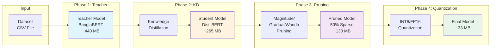
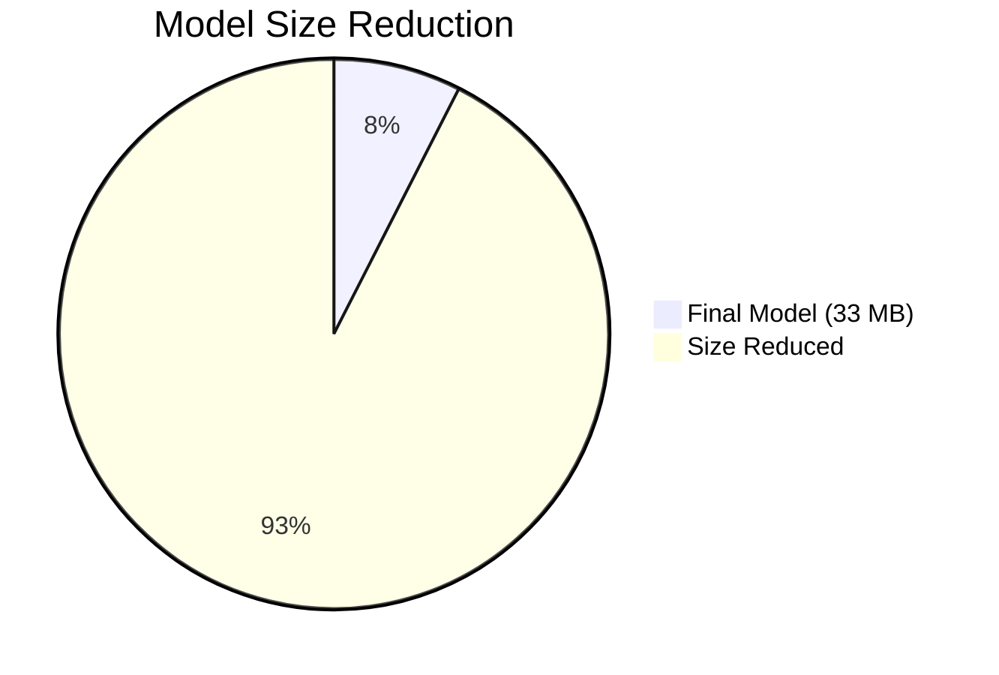
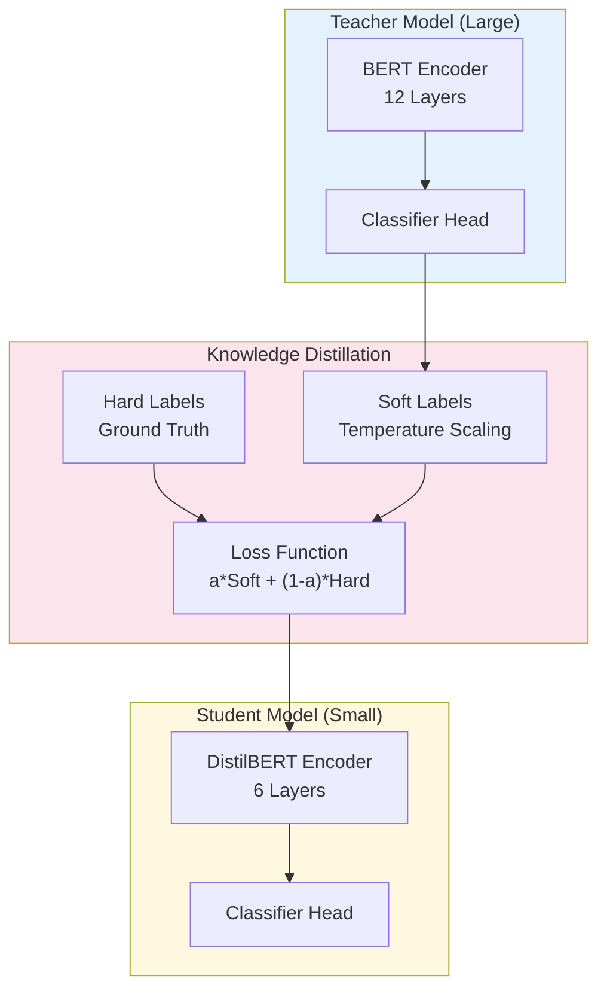
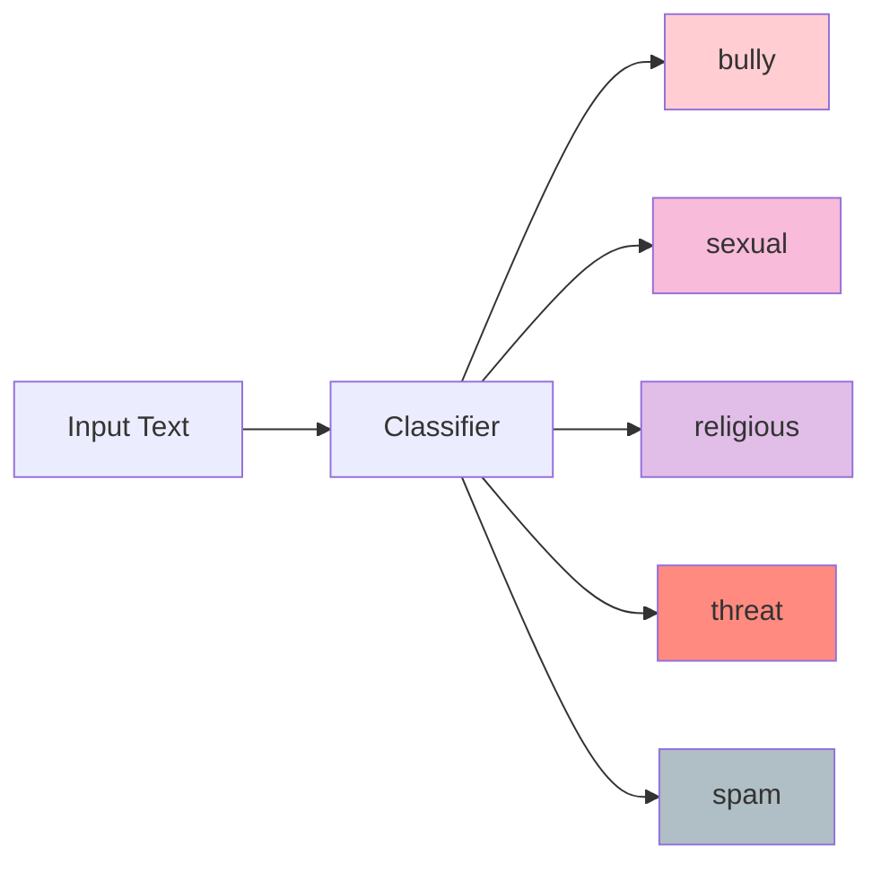
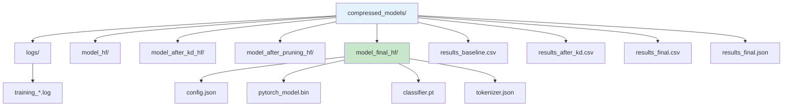
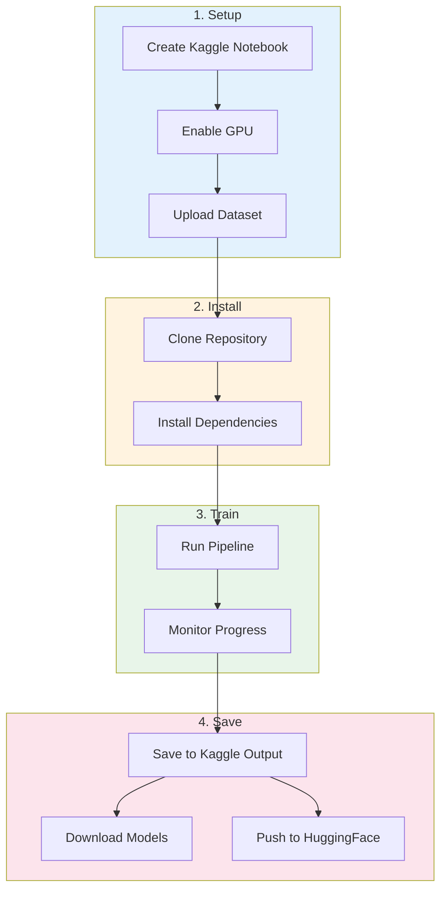
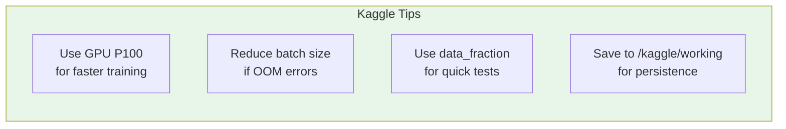

# Bangla Cyberbullying Detection - Model Compression Framework

A comprehensive framework for training, compressing, and deploying transformer-based models for multi-label Bangla cyberbullying detection.

## Overview

This framework implements a complete pipeline for:
- **Knowledge Distillation (KD)**: Transfer knowledge from a large teacher model to a smaller student
- **Pruning**: Remove unnecessary weights to reduce model size
- **Quantization**: Reduce precision (FP32 → INT8/FP16) for faster inference

### Pipeline Flow



### Compression Results



### Architecture Overview



### Labels

The model performs multi-label classification with 5 categories:



- `bully` - General cyberbullying
- `sexual` - Sexual harassment
- `religious` - Religious hate speech
- `threat` - Threats and violence
- `spam` - Spam content

## Installation

### Requirements

- Python 3.8+
- PyTorch 1.10+
- CUDA 11.0+ (for GPU support)

### Install Dependencies

```bash
pip install torch torchvision transformers
pip install scikit-learn pandas numpy tqdm
pip install iterstrat  # For multilabel stratification

# Optional: For INT4 quantization
pip install bitsandbytes
```

## Dataset Format

The dataset should be a CSV file with the following structure:

| comment | bully | sexual | religious | threat | spam |
|---------|-------|--------|-----------|--------|------|
| আপনার টেক্সট | 1 | 0 | 0 | 0 | 0 |
| আরেকটি টেক্সট | 0 | 1 | 0 | 1 | 0 |

- `comment`: The text column (Bangla text)
- Label columns: Binary values (0 or 1) for each category

## Quick Start

### Basic Training (with pre-trained teacher)

```bash
python main.py \
    --dataset_path ./data/1_Multilablel_Cyberbully_Data.csv \
    --author_name your_name \
    --pipeline kd_only \
    --teacher_checkpoint your-username/banglabert-cyberbullying
```

### Quick Test Run (10% data)

```bash
python main.py \
    --dataset_path ./data/1_Multilablel_Cyberbully_Data.csv \
    --author_name your_name \
    --pipeline kd_only \
    --teacher_checkpoint your-username/banglabert-cyberbullying \
    --data_fraction 0.1
```

### Full Compression Pipeline

```bash
python main.py \
    --dataset_path ./data/1_Multilablel_Cyberbully_Data.csv \
    --author_name your_name \
    --pipeline kd_prune_quant \
    --teacher_checkpoint your-username/banglabert-cyberbullying \
    --prune_sparsity 0.5 \
    --quant_method fp16
```

## Training Guide

### Pipeline Options

| Pipeline | Description | Stages |
|----------|-------------|--------|
| `baseline` | Evaluate teacher only | Teacher → Evaluate |
| `kd_only` | Knowledge Distillation | Teacher → KD → Student |
| `prune_only` | Pruning only | Teacher → Prune |
| `quant_only` | Quantization only | Teacher → Quantize |
| `kd_prune` | KD + Pruning | Teacher → KD → Student → Prune |
| `kd_quant` | KD + Quantization | Teacher → KD → Student → Quantize |
| `prune_quant` | Pruning + Quantization | Teacher → Prune → Quantize |
| `kd_prune_quant` | Full pipeline | Teacher → KD → Student → Prune → Quantize |

### Using a Pre-trained Teacher

If you have a fine-tuned teacher model on HuggingFace:

```bash
python main.py \
    --dataset_path ./data/your_data.csv \
    --author_name your_name \
    --pipeline kd_prune_quant \
    --teacher_checkpoint your-username/banglabert-cyberbullying
```

### Training Teacher from Scratch

If you don't have a pre-trained teacher:

```bash
python main.py \
    --dataset_path ./data/your_data.csv \
    --author_name your_name \
    --pipeline kd_prune_quant \
    --teacher_path csebuetnlp/banglabert \
    --teacher_epochs 10
```

### K-Fold Cross-Validation

For robust evaluation across all folds:

```bash
python main.py \
    --dataset_path ./data/your_data.csv \
    --author_name your_name \
    --pipeline kd_only \
    --teacher_checkpoint your-username/banglabert-cyberbullying \
    --run_full_kfold \
    --num_folds 5
```

### Priority Labels

Weight certain labels higher in metrics calculation:

```bash
python main.py \
    --dataset_path ./data/your_data.csv \
    --author_name your_name \
    --pipeline kd_only \
    --teacher_checkpoint your-username/banglabert-cyberbullying \
    --label_priority '{"threat": 3, "sexual": 2}'
```

## Inference Guide

### Single Text Prediction

```bash
python inference.py \
    --model_path ./compressed_models/model_final_hf \
    --text "আপনার বাংলা টেক্সট এখানে"
```

### Batch Prediction from CSV

```bash
python inference.py \
    --model_path ./compressed_models/model_final_hf \
    --input_csv test_data.csv \
    --output_csv predictions.csv \
    --text_column comment
```

### Interactive Mode

```bash
python inference.py \
    --model_path ./compressed_models/model_final_hf \
    --interactive
```

### Python API

```python
from inference import CyberbullyingClassifier

# Load model
classifier = CyberbullyingClassifier(
    model_path='./compressed_models/model_final_hf'
)

# Single prediction
result = classifier.predict_single("আপনার টেক্সট")
print(result['labels'])  # ['bully', 'threat']
print(result['probabilities'])  # {'bully': 0.92, 'sexual': 0.1, ...}

# Batch prediction
texts = ["টেক্সট ১", "টেক্সট ২", "টেক্সট ৩"]
df = classifier.predict_batch(texts)
df.to_csv('predictions.csv')
```

## Metrics Reference

### Classification Metrics

| Metric | Description | Range |
|--------|-------------|-------|
| **F1 Macro** | Unweighted mean of per-label F1 scores | 0-1 |
| **F1 Weighted** | Support-weighted mean of per-label F1 | 0-1 |
| **F1 Micro** | Global TP/FP/FN calculation | 0-1 |
| **F1 Per-label** | F1 score for each of 5 labels | 0-1 |
| **Precision Macro** | Average precision across labels | 0-1 |
| **Recall Macro** | Average recall across labels | 0-1 |
| **Accuracy** | Exact match accuracy | 0-1 |
| **ROC-AUC** | Area under ROC curve | 0-1 |
| **Hamming Loss** | Fraction of wrong labels | 0-1 (lower is better) |

### Efficiency Metrics

| Metric | Description | Unit |
|--------|-------------|------|
| **Latency Mean** | Average inference time | milliseconds |
| **Latency P50** | Median (50th percentile) | milliseconds |
| **Latency P95** | 95th percentile latency | milliseconds |
| **Latency P99** | 99th percentile latency | milliseconds |
| **Throughput** | Samples processed per second | samples/sec |
| **Peak Memory** | Maximum GPU memory used | MB |

### Compression Metrics

| Metric | Description | Unit |
|--------|-------------|------|
| **Model Size** | Size on disk | MB |
| **Parameters** | Total trainable parameters | count |
| **Sparsity** | Percentage of zero weights | % |
| **Compression Ratio** | Original size / Final size | x factor |

## CLI Arguments Reference

### Required Arguments

| Argument | Description |
|----------|-------------|
| `--dataset_path` | Path to CSV dataset file |
| `--author_name` | Author name for output directory |

### Pipeline Configuration

| Argument | Default | Description |
|----------|---------|-------------|
| `--pipeline` | `kd_only` | Pipeline to run (see Pipeline Options) |
| `--teacher_path` | `csebuetnlp/banglabert` | Base teacher model path |
| `--teacher_checkpoint` | None | Pre-trained teacher checkpoint (skip training) |
| `--student_path` | `distilbert-base-multilingual-cased` | Student model path |

### Training Parameters

| Argument | Default | Description |
|----------|---------|-------------|
| `--batch` | 32 | Batch size |
| `--lr` | 2e-5 | Learning rate |
| `--epochs` | 15 | Number of KD epochs |
| `--teacher_epochs` | 10 | Teacher training epochs |
| `--max_length` | 128 | Max sequence length |
| `--num_folds` | 5 | Number of K-folds |
| `--run_full_kfold` | False | Run all K folds |
| `--data_fraction` | 1.0 | Fraction of data to use |

### Knowledge Distillation

| Argument | Default | Description |
|----------|---------|-------------|
| `--kd_alpha` | 0.7 | Soft/hard label balance (0=hard, 1=soft) |
| `--kd_temperature` | 4.0 | Distillation temperature |
| `--kd_method` | `logit` | KD method (logit, hidden, attention, multi_level) |

### Pruning Parameters

| Argument | Default | Description |
|----------|---------|-------------|
| `--prune_method` | `magnitude` | Pruning method (magnitude, gradual, wanda) |
| `--prune_sparsity` | 0.5 | Target sparsity (50%) |
| `--prune_schedule` | `cubic` | Sparsity schedule (linear, cubic, exponential) |
| `--fine_tune_after_prune` | True | Fine-tune after pruning |
| `--fine_tune_epochs` | 3 | Fine-tuning epochs |

### Quantization Parameters

| Argument | Default | Description |
|----------|---------|-------------|
| `--quant_method` | `dynamic` | Method (dynamic, static, fp16, int4) |
| `--quant_dtype` | `int8` | Data type (int8, int4, fp16) |
| `--latency_batch_size` | 1 | Batch size for latency measurement |

### Output

| Argument | Default | Description |
|----------|---------|-------------|
| `--output_dir` | `./compressed_models` | Output directory |
| `--cache_dir` | `./cache` | Cache directory |
| `--save_all_stages` | True | Save model at each stage |

## Troubleshooting

### Common Issues

#### 1. CUDA Out of Memory

```
RuntimeError: CUDA out of memory
```

**Solutions:**
- Reduce batch size: `--batch 16` or `--batch 8`
- Use data fraction: `--data_fraction 0.5`
- Use FP16 for quantization: `--quant_method fp16`

#### 2. Tokenizer Parallelism Warning

```
huggingface/tokenizers: The current process just got forked...
```

**Solution:** This is handled automatically. The warning can be ignored.

#### 3. bitsandbytes Not Found (INT4)

```
ImportError: bitsandbytes not installed
```

**Solution:**
```bash
pip install bitsandbytes
```

#### 4. Model Not Loading Correctly

Ensure the model was saved correctly with all files:
- `config.json`
- `pytorch_model.bin` or `model.safetensors`
- `classifier.pt`
- `classifier_config.json`
- `tokenizer.json` / `vocab.txt`

### Performance Tips

1. **Use GPU**: Ensure CUDA is available for training
2. **Batch Size**: Larger batches = faster training, but more memory
3. **Data Fraction**: Start with `--data_fraction 0.1` for quick testing
4. **FP16 for GPU**: Use `--quant_method fp16` for GPU deployment
5. **INT8 for CPU**: Use `--quant_method dynamic` for CPU deployment

## Log Files

Training logs are saved to `{output_dir}/logs/training_{timestamp}.log`

### Log Contents

- Configuration parameters
- Dataset statistics
- Model architecture details
- Per-epoch training metrics
- Stage transitions
- Memory usage
- Final results summary

### Viewing Logs

```bash
# View real-time logs
tail -f ./compressed_models/logs/training_*.log

# Search for errors
grep "ERROR" ./compressed_models/logs/training_*.log
```

## Output Directory Structure



```
compressed_models/
├── logs/
│   └── training_20240115_143022.log
├── model_hf/                    # Teacher model (HuggingFace format)
├── model_after_kd_hf/           # Student after KD
├── model_after_pruning_hf/      # After pruning
├── model_final_hf/              # Final compressed model
├── results_baseline.csv         # Baseline metrics
├── results_after_kd.csv         # Post-KD metrics
├── results_after_pruning.csv    # Post-pruning metrics
├── results_after_quantization.csv
├── results_final.csv            # All stages comparison
├── results_final.json           # Full metrics in JSON
└── results_all.csv              # Cumulative results
```

## Using on Kaggle

This section provides a complete guide for running the framework on Kaggle notebooks.

### Kaggle Workflow Overview



### Step 1: Create a Kaggle Notebook

1. Go to [kaggle.com](https://www.kaggle.com)
2. Click **"Create"** → **"New Notebook"**
3. Enable GPU: **Settings** → **Accelerator** → **GPU P100** or **T4 x2**
4. Set persistence: **Settings** → **Persistence** → **Files only**

### Step 2: Upload Your Dataset

**Option A: Upload directly**
1. Click **"Add data"** in the right sidebar
2. Upload your CSV file
3. Your data will be at: `/kaggle/input/your-dataset-name/`

**Option B: Use Kaggle Datasets**
```python
# If your dataset is already on Kaggle
!kaggle datasets download -d your-username/your-dataset
!unzip your-dataset.zip -d /kaggle/working/data/
```

### Step 3: Setup the Framework

Create a new code cell and run:

```python
# Cell 1: Clone the repository
!git clone https://github.com/SaifSiddique009/kd_pruning_quantization_framework_for_nlp.git
%cd kd_pruning_quantization_framework_for_nlp/phase_3_final

# Cell 2: Install dependencies
!pip install -q transformers torch scikit-learn pandas numpy tqdm iterstrat

# Optional: For INT4 quantization
!pip install -q bitsandbytes
```

### Step 4: Verify GPU is Available

```python
# Cell 3: Check GPU
import torch
print(f"PyTorch version: {torch.__version__}")
print(f"CUDA available: {torch.cuda.is_available()}")
if torch.cuda.is_available():
    print(f"GPU: {torch.cuda.get_device_name(0)}")
    print(f"Memory: {torch.cuda.get_device_properties(0).total_memory / 1e9:.1f} GB")
```

### Step 5: Run the Training Pipeline

**Quick Test (10% data)**
```python
# Cell 4: Quick test run
!python main.py \
    --dataset_path /kaggle/input/your-dataset/data.csv \
    --author_name your_name \
    --pipeline kd_only \
    --teacher_checkpoint your-hf-username/banglabert-cyberbullying \
    --data_fraction 0.1 \
    --output_dir /kaggle/working/compressed_models \
    --cache_dir /kaggle/working/cache
```

**Full Training**
```python
# Cell 5: Full pipeline
!python main.py \
    --dataset_path /kaggle/input/your-dataset/data.csv \
    --author_name your_name \
    --pipeline kd_prune_quant \
    --teacher_checkpoint your-hf-username/banglabert-cyberbullying \
    --prune_sparsity 0.5 \
    --quant_method fp16 \
    --output_dir /kaggle/working/compressed_models \
    --cache_dir /kaggle/working/cache \
    --batch 16
```

**With K-Fold Cross-Validation**
```python
# Cell 6: Full K-fold evaluation
!python main.py \
    --dataset_path /kaggle/input/your-dataset/data.csv \
    --author_name your_name \
    --pipeline kd_prune_quant \
    --teacher_checkpoint your-hf-username/banglabert-cyberbullying \
    --run_full_kfold \
    --num_folds 5 \
    --output_dir /kaggle/working/compressed_models
```

### Step 6: Monitor Training Progress

```python
# Cell 7: View logs in real-time
!tail -f /kaggle/working/compressed_models/logs/*.log
```

Or view results after training:
```python
# Cell 8: View results
import pandas as pd

# Load results
results = pd.read_csv('/kaggle/working/compressed_models/results_final.csv')
print(results.to_string())

# View comparison
print("\n=== Stage Comparison ===")
print(results[['stage', 'f1_macro', 'model_size_mb', 'latency_mean_ms']])
```

### Step 7: Save and Download Models

**Save to Kaggle Output**
```python
# Cell 9: Copy to output (persists after session)
import shutil
shutil.copytree(
    '/kaggle/working/compressed_models',
    '/kaggle/working/output/compressed_models'
)
print("Models saved to /kaggle/working/output/")
```

**Push to HuggingFace Hub**
```python
# Cell 10: Push to HuggingFace (optional)
from huggingface_hub import HfApi, login

# Login to HuggingFace
login(token="your_hf_token")  # Or use notebook secrets

# Upload model
api = HfApi()
api.upload_folder(
    folder_path="/kaggle/working/compressed_models/model_final_hf",
    repo_id="your-username/bangla-cyberbullying-compressed",
    repo_type="model"
)
print("Model uploaded to HuggingFace!")
```

### Step 8: Run Inference on Kaggle

```python
# Cell 11: Test inference
import sys
sys.path.append('/kaggle/working/kd_pruning_quantization_framework_for_nlp/phase_3_final')

from inference import CyberbullyingClassifier

# Load the compressed model
classifier = CyberbullyingClassifier(
    model_path='/kaggle/working/compressed_models/model_final_hf'
)

# Test prediction
result = classifier.predict_single("তোমাকে মেরে ফেলব")
print(f"Labels: {result['labels']}")
print(f"Probabilities: {result['probabilities']}")
```

### Complete Kaggle Notebook Template

Here's a complete notebook you can copy:

```python
# =============================================================================
# CELL 1: Setup
# =============================================================================
!git clone https://github.com/SaifSiddique009/kd_pruning_quantization_framework_for_nlp.git
%cd kd_pruning_quantization_framework_for_nlp/phase_3_final
!pip install -q transformers scikit-learn pandas numpy tqdm iterstrat

# =============================================================================
# CELL 2: Check GPU
# =============================================================================
import torch
print(f"GPU: {torch.cuda.get_device_name(0) if torch.cuda.is_available() else 'Not available'}")

# =============================================================================
# CELL 3: Run Training (adjust paths as needed)
# =============================================================================
!python main.py \
    --dataset_path /kaggle/input/bangla-cyberbullying/1_Multilablel_Cyberbully_Data.csv \
    --author_name kaggle_user \
    --pipeline kd_prune_quant \
    --teacher_checkpoint csebuetnlp/banglabert \
    --teacher_epochs 5 \
    --epochs 10 \
    --prune_sparsity 0.5 \
    --quant_method fp16 \
    --batch 16 \
    --data_fraction 1.0 \
    --output_dir /kaggle/working/compressed_models

# =============================================================================
# CELL 4: View Results
# =============================================================================
import pandas as pd
results = pd.read_csv('/kaggle/working/compressed_models/results_final.csv')
print(results[['stage', 'f1_macro', 'model_size_mb', 'latency_mean_ms']])

# =============================================================================
# CELL 5: Test Inference
# =============================================================================
from inference import CyberbullyingClassifier
classifier = CyberbullyingClassifier('/kaggle/working/compressed_models/model_final_hf')
print(classifier.predict_single("টেস্ট টেক্সট"))
```

### Kaggle-Specific Tips



| Tip | Description |
|-----|-------------|
| **GPU Selection** | P100 is faster than T4 for training. T4 x2 offers more VRAM |
| **Memory Management** | Use `--batch 16` or `--batch 8` if you get OOM errors |
| **Quick Testing** | Use `--data_fraction 0.1` to test with 10% of data first |
| **Session Limits** | Kaggle has 12-hour GPU session limits. Save checkpoints! |
| **Output Persistence** | Files in `/kaggle/working/` persist after kernel restart |
| **Internet Access** | Enable "Internet" in settings to download models from HuggingFace |

### Troubleshooting on Kaggle

**Issue: CUDA Out of Memory**
```python
# Solution: Reduce batch size
!python main.py ... --batch 8
```

**Issue: Session Timeout**
```python
# Solution: Use data_fraction and save intermediate results
!python main.py ... --data_fraction 0.5 --save_all_stages
```

**Issue: Cannot find dataset**
```python
# Check available input files
import os
for root, dirs, files in os.walk('/kaggle/input'):
    for file in files:
        print(os.path.join(root, file))
```

**Issue: Model download fails**
```python
# Solution: Enable internet in notebook settings
# Settings → Internet → On
```

## Citation

If you use this framework, please cite:

```bibtex
@software{bangla_cyberbullying_compression,
  title = {Bangla Cyberbullying Detection - Model Compression Framework},
  author = {Saif Siddique},
  year = {2026},
  url = {https://github.com/SaifSiddique009/kd_pruning_quantization_framework_for_nlp.git}
}
```

## License

MIT License
